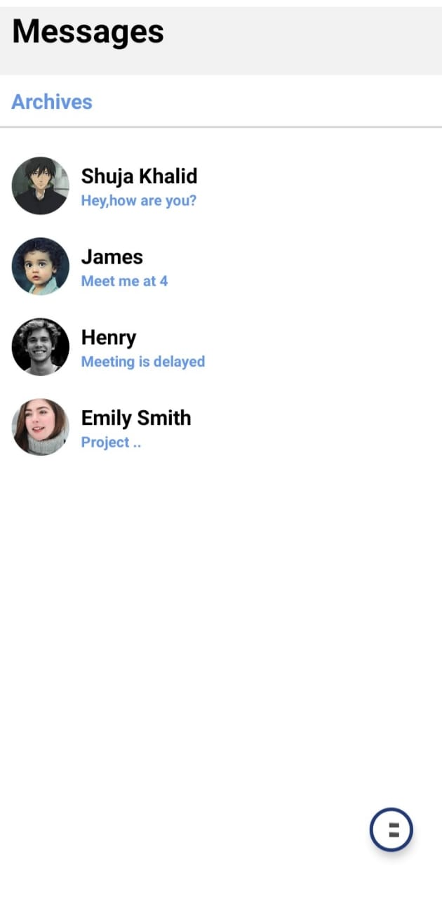
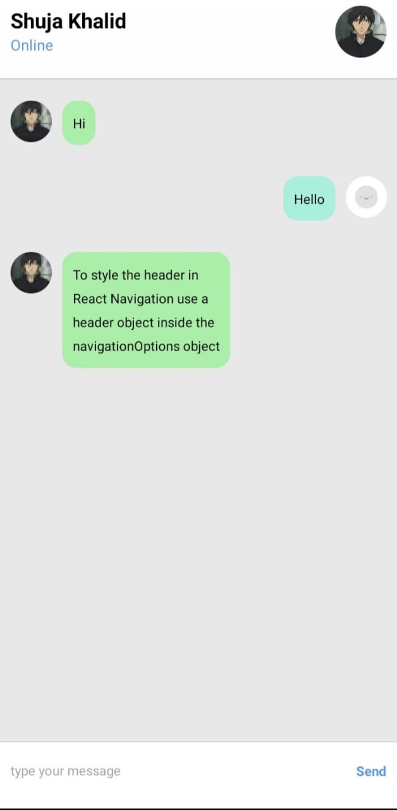

## Simple React Native Chat App 

:warning: **This project need collaborators**:

Join our [discord server](https://discord.gg/PFqtwbVXMK)

A simple react native chat app design built using expo react native. This example was put together by me with intend to educate beginners about industry standard design rules.

### Try this on your device
Scan with expo go app
    

### Installation

- `git clone https://github.com/shujakhalid19/Chatapp`

### Running

- `npm run start`

---

This project was put together by me to serve as an example to help you in building your own React Native Application.